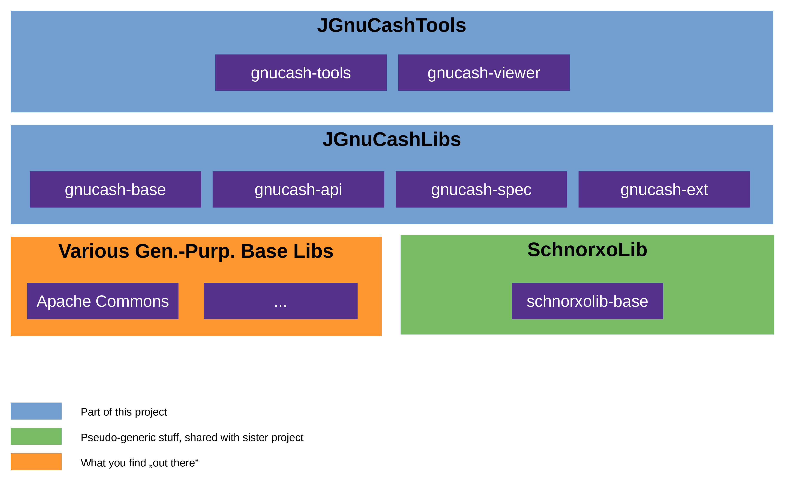

# Project "Java GnuCash Lib 'n' Tools"

`JGnuCashLibNTools` 
is a free and open-source set of Java-libraries for reading and writing the XML file 
format of the 
GnuCash open source small-business accounting software 
([gnucash.org](https://gnucash.org)).

This project is not affiliated with nor sponsored or coordinated by the developers of the 
GnuCash 
project.

It began as a friendly fork of Deniss Larka's `jgnucashlib` (cf. section "Acknowledgements" at the end of this document).
After initial cooperation, it has gone its own way (we are still on friendly terms). 
Since then, the code has undergone a lot of changes, and the project has greatly expanded its scope as well as its 
quality by introducing regression tests.

## Modules and Further Details

Here is a high-level overview:



List of modules and other relevant stuff:

* JGnuCashLibs (the API)

  The four following together form the API:

  * [Base (gnucash-base)](https://github.com/jross765/gnucash-base)

    Some basic data types and helper classes (project-specific).

  * [API (gnucash-api)](https://github.com/jross765/gnucash-api)

    The Core API (read/write) -- no bells, no whistles, yet still providing a certain level 
    of convenience as well as solid type safety and input-value checks.

    "Good and well-tested wrappers for the the JAXB-generated classes".

  * [API Specialized Entities (gnucash-spec)](https://github.com/jross765/gnucash-api-spec)

    Bells & whistles, part 1: Some specialized classes derived from the Core API.

  * [API Extensions (gnucash-ext)](https://github.com/jross765/gnucash-api-ext)

    Bells & whistles, part 2: Some specialized helper classes providing
    high-level functionalities based on low-level actions in of both the Core API
    and the Specialized Entities.

* JGnuCashTools:

  * [Tools (gnucash-tools)](https://github.com/jross765/gnucash-tools)

    CLI Tools (read/write).

  * [Viewer (gnucash-viewer)](https://github.com/jross765/gnucash-viewer)

    The (read-only) GUI.

  * [Example Programs (gnucash-api-examples)](https://github.com/jross765/gnucash-api-examples)


    Some examples on how to use the API (all levels).

    Actually not "officially" part of the 
    JGnuCashTools, 
    but we won't define a new category just for this one, and they are in the same ballpark...

* Project-specific basic stuff:

  There is one project-specific pseudo-base-lib containing some semi-generic
  stuff used by this project as well as by its sister:

  [SchnorxoLib](https://github.com/jross765/schnorxolib)

  It contains some basic data types and helper classes
  used by both projects.

* Miscellaneous:

  Of course, a couple of "real" libs are also used:

  * [Jakarta XML Binding (JAXB)](https://eclipse-ee4j.github.io/jaxb-ri/)

    Obviously...

  * [Apache Commons](https://commons.apache.org)

    Ye olde venerable collection of general-purpose Java libs.
    The following ones are used:

    * [CLI](https://commons.apache.org/proper/commons-cli/)
    * [Configuration](https://commons.apache.org/proper/commons-configuration/)
    * [IO](https://commons.apache.org/proper/commons-io/)
    * [Numbers](https://commons.apache.org/proper/commons-numbers/)

  * [Joda Money](https://www.joda.org/joda-money/)

    (Doesn't provide real added value in this project. We will therefore 
    probably get rid of that dependency in the next release).

  * [Progress Bar](https://github.com/ctongfei/progressbar/)

  * [JLine](https://jline.org/)

## Compatibility
### System and Format Compatibility
Version 2026-04
of the libs and tools has been tested with 
GnuCash 5.14 
on Linux (locale de_DE) and 
OpenJDK 21.0.

### Locale/Language Compatibility
**Caution:** Will only work on systems with the following locale languages:

* English
* Spanish
* French
* German

However, it has **not** been thoroughly tested with all of them, but just on a system with locale de_DE (for details, cf. the API module documentation).

### Version Compatibility

| Overall Version | Backward Compat. | Note                   |
|---------|------------------|--------------------------------|
| 2026-04 | no      | "Medium" changes in interfaces |
| 1.8     | almost  | Minor changes in interfaces    |
| 1.7     | no      | "Medium" changes in interfaces |
| 1.6     | almost  | Minor changes in interfaces, partially extensions |
| 1.5     | almost  | Minor changes in interfaces    |
| 1.4     | no      | Some substantial changes       |
| 1.3     | no      | "Medium" changes in interfaces |
| 1.2     | almost  | Minor changes in interfaces    |
| 1.1     | no      | Major changes in interfaces    |
| 1.0.1   | yes     | Fixed one bug in V. 1.0        |

## Major Changes
Here, only the top-level changes on module-level are mentioned. 
For more details, cf. the README files of the resp. modules (links above).

### V. 1.8 &rarr; 2026-04
**Caution: With this release, the top-level version naming scheme has changed
in order to avoid confusion with the single modules' version numbers.**

* Parent repo (this one): Nothing special.

* Module "Base": Changed class names, now finally fully honoring the GnuCash naming 
  convention ("security" vs  "commodity").

* Module "API (Core)":
  * Loading files now shows progress bars in console (optional).
  * Maintenance.

* Module "API Specialized Entities: New.

* Module "API Extensions": Maintenance.

* Module "API Examples": 
  * New example program for API Specialized Entities".
  * New package structure to better reflect different modules.

* Module "Tools":
  * All tools now load files showing progress bars (cf. Module "API (Core)").
  * Maintenance.

* Module "Viewer":
  * Program now accepts various command line args, supporting start variants,
    supporting various additonal use cases.
  * Maintenance.

Module versions:

| Name                     | Version |
|--------------------------|---------|
| Base                     | 1.8     |
| API (Core)               | 1.8     |
| API Specialized Entities | 0.3     |
| API Extensions           | 1.8     |
| API Examples             | 1.8     |
| Tools                    | 1.8     |
| Viewer                   | 1.2     |

### V. 1.7 (RESTRUCT) &rarr; 1.8
**Caution: Please note that, due to the changes in the last major release 
(splitting up the one big repository in several smaller ones), 
from now on, each module is versioned on its own, and the overall project's version 
(1.8, in this case) 
need not be/is not identical to the single modules' versions any more.**

* Parent repo (this one): Finished restruct work, i.e. made the
  (Maven) modules' repos Git sub-modules as well.

* Module "Viewer": New.

  Well, only technically new in this project; originally written by Marcus Wolschon 
  and maintained by Roberto Bertolino for a while, I have taken it and adapted it 
  to this fork. In short: Simplified it (viewer only, no editing) and I18N.

* Module "API": Bug-fixes and mini-improvements.

* The other modules have changed only technically; essentially (i.e., code) unchanged:
  * "Base"
  * "API Examples"
  * "API Extensions"
  * "Tools"

Module versions:

| Name                     | Version |
|--------------------------|---------|
| Base                     | 1.7.1   |
| API (Core)               | 1.7.1   |
| API Extensions           | 1.7.1   |
| API Examples             | 1.7.1   |
| Tools                    | 1.7.1   |
| Viewer                   | 1.1.0   |

### V. 1.7 &rarr; 1.7 (RESTRUCT)
Split up the all-encompassing repository into several ones: One per module plus one for the parent (this one).

Apart from that, I have made *no relevant changes* (i.e. only small changes in the README-files etc., but not in the actual source code).

*Rationale*:

I know, that comes with some disadvantages, and there are quite a few people who would advise against it for valid reasons. 

That being said, life's not black and white, and while I acknowledge that having everything in one single repository makes things easier in the early stages of development, I am convinced that in the long run, the advantages of doing so will outweigh the disadvantages for the following reasons:

* The modules' rates of change will vary considerably (they already do, and they will problably do even more in the years to come).

* It feels odd *not* to have "API Examples" and "Tools" in separate repositories (and that's just the most obvious example).

* The measure will greatly facilitate accepting and managing future contributions from others (or possibly handing single modules completely over to others), which I currently would feel much more inclined to do for the modules "API Extensions" and "Tools" than for the other ones.
  
* Last not least, I manage some additional (unpublished) projects that way, and I would like to keep things consistent (you see, my day has only 24 hours just as yours, and I have other things to do...).

*History*:

I have made a clean cut:

* The top-level repository (this one) contains the whole history up to V. 1.7. 
* The newly-generated sub-repos contain no history until V. 1.7. But they will contain their respective module's history from that point onwards.

### V. 1.6 &rarr; 1.7
* Overall:
  * Introduced new (dummy) ID types for type safety and better symmetry with sister project.

### V. 1.5 &rarr; 1.6
* Module "API": 
 
  * Some bug-fixing and cleanup-work, making code more robust.
  * New functionalities.

* Module "API Extensions": 
  * New sub-module.
  * Expanded functionality of already-existing module.

* Module "Tools": Maintenance.

### V. 1.4 &rarr; 1.5
* Added module "Tools".

* New external dependency (outside of Maven central): 
[`SchnorxoLib`](https://github.com/jross765/Schnorxolib), 
a small library that contains some auxiliary stuff that is used both in this and the sister project. Some of the code in the module "Base" has moved there.

### V. 1.3 &rarr; 1.4
Changed project structure:

* Introduced new module "Base" (spun off from "API").

	This was necessary because the author is using the new module in other, external projects (not published).

* Introduced new module "API Extensions"

	Currently, this module it is very small. It will (hopefully) grow.

### V. 1.2 &rarr; 1.3 and Before
Cf. the README file of modules "API" and "Example programs" (links below).

## Level of Maturity
This software is beta.

It is worth noting, though, that the author has been using both the published tools 
as well as some unpublished ones (the latter ones also based on 
`JGnuCashLibs`) 
on a nearly daily basis 
for a over a year now (march 2026)
to facilitate and part-automate his 
business' 
accounting. This proves that the software is well-tested and stable enough 
for a real-world setting (as opposed to theoretical test cases and arbitrary examples).

Therefore, the current maintainer now feels confident not just to use the software in 
his own particular productive environment, but also to encourage others to use it. 
However, he is experienced a developer enough to know that there are other production 
environments and other use cases out there, and that only by further usage and testing 
by at least a handful of other users in real-world scenarios for a year or so, the 
software can mature to finally attain genuine "production-ready" status.

In short: You are encouraged to use this software, but be advised to use it under the following principles:

*  Consider the API's read-branch and the read-only tools to be safe (i.e., they are not only *called* read-only, but they actually *are*).

* As for the write-branch, take the usual precautions: 

  * Do not just take the software and "wildly" change things in your valuable 
    GnuCash 
    files that you may have been building for years or possibly even decades. 
    It still might contain some non-trivial bugs, and you should not assume that 
    it works correctly in all conceivable edge and corner cases.
  * If you write your own tools, be aware that the lib allows you to *change* the 
    GnuCash 
    file loaded. You are, however, advised not to do so in the beta stage, but 
    rather to *generate a new one* instead (as done in the published tools) and 
    keep the old version for a while.
  * If you have to change your file, **make backups before you use this lib/these tools!** Take your time and check the generated/changed files thoroughly before moving on.
    The `diff` tool is your friend as well as the provided `Dump` tool!

## Compiling the Sources
To compile the sources, do the following:

1) Make sure that you have Maven installed on your system.

2) Build and install [`SchnorxoLib`](https://github.com/jross765/Schnorxolib) (cf. details there).

3) Clone this repository as well as its sub-repositories. 

      ```console
    $ git clone --recurse-submodules https://github.com/jross765/JGnuCashLibNTools
      ```

4) Check out the latest version tag. In this case: `V_2026-04`.

      The current maintainer has, in the course of his professional career, met plenty of self-declared 
      super-pro developers who do not seem to understand the concept of version tags and configuration 
      management, so please bear with him for telling you the seemlingly obvious...

5) Compile the sources:

      a) Adapt the path to your local repository in *all* pom.xml files 
         (search for "`schnorxolib-base-systemPath`" and "`xxx`").
         All other libs are drawn from Maven Central.

      b) Type:

         ```console
       $ ./build.sh
         ```

6) Perform the test cases (optional):

      ```console
    $ ./test.sh
      ```

## Installing and Using the Software

Installation is a manual process -- there is no "install" target
in the build process (well, there actually is one, but only
in the Maven sense, meaning its repository under `~/.m2`).

Consequently, there is no pre-defined/default path for the software; 
it does not really matter.

As always with Java libs, you will have to set the classpath file,
preferrably in a file called `environment.sh` that you must source
before starting one of the tools. Don't forget the basic libs used 
(list above).

For convenience, the build process also generates top-level JAR files 
that contain all dependencies (modules 
"gnucash-tools" and "gnucash-viewer").

You will also have to write your own wrapper scripts for the tools (for now).
(No, the maintainer cannot provide his own ones, at least not right now,
for specific reasons which he won't dive into now.)
You will find an example wrapper script in the folder `doc/user`.

In short: Nothing special; just as it's usually done with Java software...


## Planned

### Overall
* Possibly contribute some more Java tools / wrapper scripts that already exist in separate repositories that currently are not published.

### Module-Specific
Cf. the according module's README file (links above).

## Sister Project
This project has a sister project: 
[`JKMyMoneyLibNTools`](https://github.com/jross765/JKMyMoneyLibNTools)

By now, both projects have roughly the same level of maturity. 
Obviously, the author strives to keep both projects symmetrical.

What does "symmetry" mean in this context? It means that 
this project's sister, `JKMyMoneyLibNTools`,
has literally evolved from a source-code copy of
this project.
Meanwhile, changes and adaptations are going in both directions.
Let's call this "coupled development". 
Given that KMyMoney and GnuCash are two finance applications with quite a few 
similarities (both in business logic and file format), this approach makes sense
and has been working well so far.

Of course, this is a "10.000-metre bird's-eye view". As always in life, things are a little more
complicated once you go into the details. Still, looking at the big picture and at least 
up to the current state of development, the author has managed to keep both projects very 
similar on a source code level -- so much so that you throughout large parts of the code,
you can use `diff`. You will, however, also see some exceptions here and there where that 
"low-level-symmetry" is not maintainable.

## Acknowledgements

Special thanks to:

* **Marcus Wolschon (Sofware-Design u. Beratung)** for the original version (from 2005) and the pioneering work and for putting the base of this project under the GPL.

    This project is based on Marcus' work. There have been major changes and additions since then, but you still can see where it originated from.

    (Forked from `http://sourceforge.net/projects/jgnucashlib` and revived in 2017, after some years of enchanted sleep.)

* **Deniss Larka** for kissing the beauty awake and taking care of her for a couple of years (excluding the viewer).

  (Forked from `https://github.com/DenissLarka/jgnucashlib` in 2023)

* **Roberto Bertolino** for contributing to Deniss' work and maintaining the viewer.

  (Module "gnucash-viewer" forked from `https://github.com/rbertoli/gnucash` in 2025)
