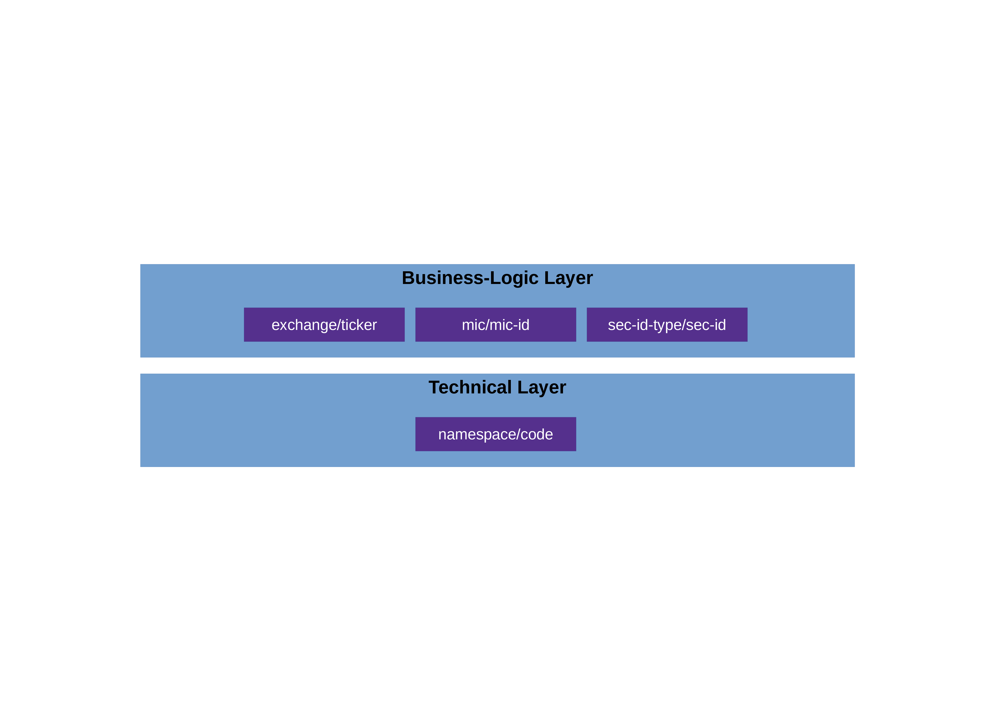

# Selecting Securities (Programmers)

Due to the specialness of securities (commodities), both on the technical level and on the business-logic level, there are several things you must understand/keep in mind before working with them.

In a nutshell, it boils down to the following:

* *Technical level*: Securities have no technical IDs in GnuCash. Instead,
  they are technically selected with a (pseudo-)technical ID, constisting of a namespace
  and a code.

* *Business-logic level*: In the real world out there, you normally would identify a security by its 
  security code, which hopefully you have used when entering the security in the GnuCash file:
  * If you live in the US or Canada, then you would typically use the 1-to-4-char ticker (such as "T" or "MSFT").
    But strictly speaking, this is not enough. It always has to be qualified with the according exchange 
    (such as "NYSE_AMERICAN" (formerly known as "AMEX") or "NASDAQ").
    (The pros among you might use the CUSIP intead.)
  * If you live outside of the US and Canada, then you would typically use something else.
    In the EU, where the current maintainer lives, people typically use the ISIN (international).
    In Germany, the nostalgic folks prefer the WKN.
    Similarly, in the rest of Europe: The SEDOL (UK) or the VALOR (Switzerland), etc. etc.
  
  If you have a global portfolio, it makes sense to use the ISIN.[^1]

## Overview

Figure \ref{fig:overview} shows the two levels of Security IDs in GnuCash:

In theory, the two layers are clearly separated, i.e. technical IDs and business-logic ID
do not have anything to do with each other. However, the GnuCash developers chose to 
make things a little more complicated: They intentionally blurred the line between
the two layers, so that technical IDs are, in fact, pseudo-technical and quasi-business.

If they had chosen to treat securties as any other entity in GnuCash, then the 
technical ID would look something like this: `14305dc80e034834b3f531696d81b493`.
This string, obviously has no meaning, i.e. it cannot / shall not be "interpreted" 
or "understood".

Well, they chose another approach: In GnuCash, a (pseudo-)technical ID looks something
like these:

* EURONEXT:SAP
* ISIN:DE000BASF111AP

Just by glancing at these, you can see that they are essentially business-logic IDs 
maskerading as technical ones; they do mean something (i.e., they have semantics) and 
can thus very well be interpreted and understood.

It is important to understand this (non-)difference between technical and business-logic IDs 
in GnuCash before reading the next section; otherwise it will probably confuse you.

You can also see that the two examples above are composed of two parts, which is no 
coincidence but the system that GnuCash imposes: `<namespace>:<code>`. Whereas the 
name space can, in theory, be freely chosen by the user, it makes sense not to do so 
but instead choosing from a pre-defined set that `JGnuCashLib` provides. This then
leads to the concept of providing IDs "indirectly", i.e. composing them: providing
the name space and the code separately.

## Specifying IDs in the API

::TODO: Follow priciple:
  1) Search for security (using name, ISIN, whatever) in order to get its (pseudo-)technical ID `secID`
  2) Use this technical ID to call `gcshFile.getSecurityByID(secID)`.

:: CAUTION "security" (as opp. to "commodity" only defined in "API Specialized Entities")
  
  The point being: Do as if you did not know what exactly the `secID` looks like; as if it were
  a UUID just as with all other GnuCash objects. You don't "read" a UUID (like: "understand" or "interpret" it),
  do you? You just know it's there, get it from one method's output and put it into another one's args.

   * First, search for a specific security with the various methods provided and then, once you have it, get its pseudo-technical ID object (`GCshSecID`) and use this one to 

Details in programs of modules "API Examples" and "Tools".

