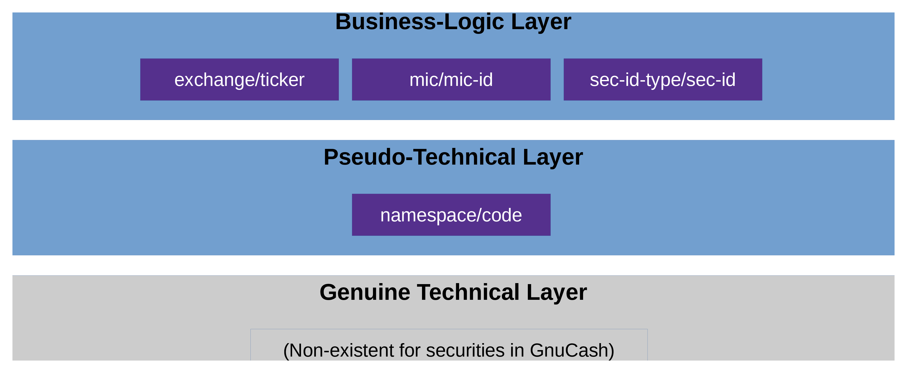

# ID Layers in GnuCash (Users and Programmers)

## Overview

Generally speaking, you normally have two ID layers in a software, i.e. two 
layers to identify objects:

* the technical layer
* the business-logic layer

A user normally only deals with the business-logic layer, whereas a 
programmer would typically work primarily with the technical layer
and provide services for the business-logic layer only indirectly,
by translating between it and the technical layer.

In 
GnuCash, 
this system is used for all entities except one: 
the securities.

## Security IDs in GnuCash

Figure \ref{fig:overview} shows the two levels of security IDs in GnuCash.

In theory, the two layers mentioned in the previous section
(i.e., the lowest and the highest one in figure \ref{fig:overview})
are clearly separated, i.e. technical IDs and 
business-logic ID do not have anything to do with each other. However, the 
GnuCash 
developers chose to make things a little more complicated: They intentionally blurred the 
line between the two layers, so that technical IDs are, in fact, pseudo-technical and quasi-business.
More precisely:

* *Pseudo-technical level*: 
  Securities 
  have no technical IDs in 
  GnuCash. 
  Instead, they are technically selected with a (pseudo-)technical ID, constisting of 
  a namespace and a code.

* *Business-logic level*: In the real world out there, you normally would identify a 
  security 
  by its 
  public security code, which hopefully you have used when entering the security in the 
  GnuCash 
  file:
  * If you live in the US or Canada, then you would typically use the 1-to-4-char ticker (such as "T" or "MSFT").
    But strictly speaking, this is not enough. It always has to be qualified with the according exchange 
    (such as "NYSE_AMERICAN" (formerly known as "AMEX") or "NASDAQ").
    (The pros among you might use the CUSIP intead.)
  * If you live outside of the US and Canada, then you would typically use something else.
    In the EU, where the current maintainer lives, people typically use the ISIN (international).
    In Germany, the nostalgic folks prefer the WKN.
    Similarly, in the rest of Europe: The SEDOL (UK) or the VALOR (Switzerland), etc. etc.
  
  If you have a global portfolio, it makes sense to use the ISIN.[^1]

So, if the developers had chosen to treat 
securities 
as any other entity in 
GnuCash, 
then a
security's
technical ID would look something like this: 
`14305dc80e034834b3f531696d81b493`.
This string obviously has no meaning, i.e. it cannot be "interpreted" 
or "understood" nor is it meant to be.

Well, they chose another approach: In 
GnuCash, 
a (pseudo-)technical 
security
ID looks something like these:

* `EURONEXT:SAP`
* `ISIN:DE000BASF111AP`

Just by glancing at these, you can see that they are essentially business-logic IDs 
maskerading as technical ones; they do mean something (i.e., they have semantics) and 
can thus very well be interpreted and understood.

It is important to understand this (non-)difference between technical and business-logic IDs in
GnuCash 
before reading the other documents; they might otherwise confuse you.

You can also see that the two examples above are composed of two parts, which is no 
coincidence but rather the system that GnuCash imposes: `<namespace>:<code>`. Whereas the 
name space can, in theory, be freely chosen by the user, in practice it makes sense *not* 
to do so but instead to choose from a pre-defined set that `JGnuCashLib` provides. This then
leads to the concept of providing IDs "indirectly", i.e. composing them: providing
the name space and the code separately.

[^1]: This is how thes current maintainer does it in his own portfolio, and it's been working well
      for decades now.
